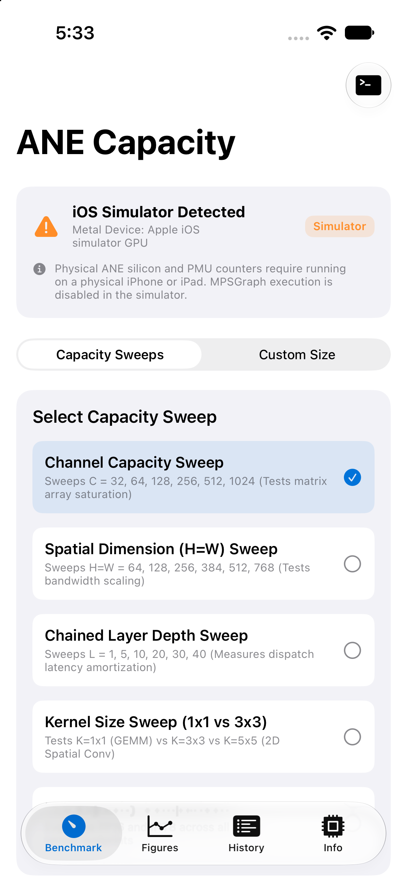
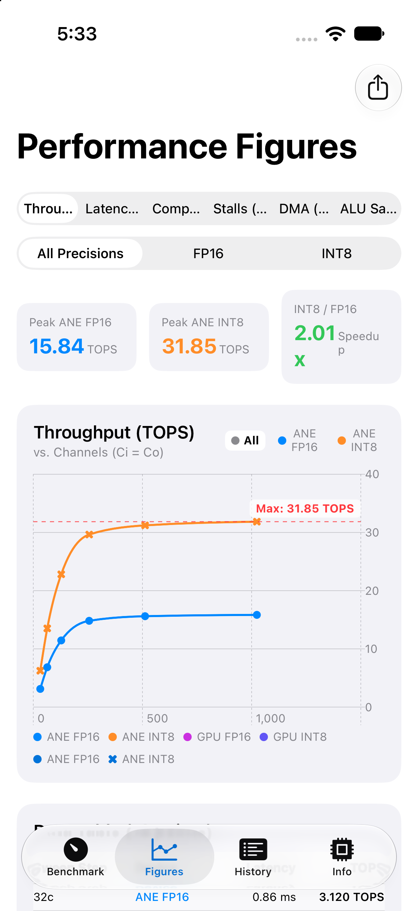
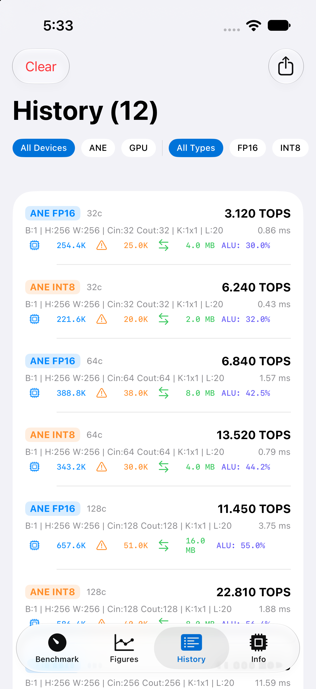
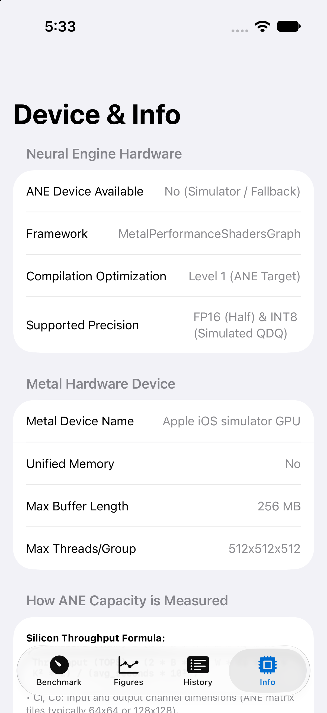

# MPSGraph Convolution Benchmark

This project benchmarks the performance of 2D convolutions on Apple Silicon using Metal Performance Shaders Graph (MPSGraph). It measures the compute capacity in TOPS (Trillions of Operations Per Second) for both the GPU and the Apple Neural Engine (ANE). A second, independent path measures the same workload through **CoreML with MIL-authored models** ([`measure_conv_coreml`](#coreml-mil-convolution-benchmark-measure_conv_coreml)), which cross-checks the MPSGraph numbers and verifies ANE op placement via `MLComputePlan`.

## Build Instructions

To compile the project, ensure you have clang and the necessary frameworks (Foundation, Metal, MetalPerformanceShadersGraph) installed (standard on macOS with Xcode Command Line Tools).

```bash
make
```

To build just the Swift version:
```bash
make measure_conv_swift
```

The CoreML benchmark additionally needs its MIL-authored models generated first, which requires [coremltools](https://github.com/apple/coremltools):
```bash
make models                 # python3 tools/gen_conv_mil.py -> models/*.mlpackage
make measure_conv_coreml
```

To clean the build artifacts:

```bash
make clean
```

### iOS Build & ANECapacityApp

The easiest and most comprehensive way to measure ANE capacity and profile silicon PMU registers on an iPhone or iPad is using the bundled SwiftUI application, [**`ANECapacityApp`**](ANECapacityApp/).

#### 1. ANECapacityApp (SwiftUI, Swift Charts & Live PMU Counters)

`ANECapacityApp` provides dual workload benchmarking (2D Convolutions and dense Matrix Multiplication / GEMM), automated capacity sweeps (Channels, Spatial, Depth, Kernel sizes, and Matrix dimensions), interactive Swift Charts with peak TOPS callouts, dynamic CSV export, and real-time Apple Neural Engine PMU performance counters (Compute Cycles, Memory Stalls, DMA traffic, ALU Saturation).

| 1. Capacity Sweeps | 2. Performance Figures | 3. History & PMU Telemetry | 4. Device Specs & Info |
| :---: | :---: | :---: | :---: |
|  |  |  |  |

To build the app for a connected physical device:
```bash
make app
```
Or open [`ANECapacityApp/ANECapacityApp.xcodeproj`](ANECapacityApp/ANECapacityApp.xcodeproj) in Xcode and press **Run (Cmd+R)** targeting your connected device.

> [!NOTE]
> Physical Apple Neural Engine silicon and PMU performance counters require a physical iPhone or iPad (not supported in the iOS Simulator).

#### 2. Standalone iOS Command-Line Binary
To compile a standalone binary for jailbroken or test environments using the iPhone SDK:

```bash
# Compile for iOS (arm64)
xcrun -sdk iphoneos clang -fobjc-arc -O3 -framework Foundation -framework Metal -framework MetalPerformanceShadersGraph measure_conv_universal.m -o measure_conv_ios

# Sign the binary (replace 'Apple Development' with your identity)
codesign -s "Apple Development" measure_conv_ios
```

## Running the Benchmark

### Standard Convolution Benchmarks
```bash
./measure_conv
```

### CoreML MIL Convolution Benchmark (`measure_conv_coreml`)
`measure_conv_coreml` measures the same convolution workload through **CoreML** instead of MPSGraph, so the two frameworks can be compared on identical arithmetic. Models are authored directly in **MIL** (Model Intermediate Language) by [`tools/gen_conv_mil.py`](tools/gen_conv_mil.py) using `coremltools.converters.mil.Builder` — no PyTorch/TensorFlow conversion in the path.

Two things this gives us that MPSGraph cannot:
- **Verified op placement.** `--plan` uses `MLComputePlan` (macOS 14.4+) to report the preferred compute device for every operation in the program. MPSGraph requires the private `preferredDevice = 2` property and offers no confirmation the work reached the ANE — we infer it from latency.
- **No private API.** The entire ANE path is public CoreML. The binary links only `CoreML` (`otool -L` shows no MetalPerformanceShadersGraph), so the comparison isn't muddied by a shared framework.

```bash
# Generate the .mlpackage models (requires coremltools), then build and run
make models
make measure_conv_coreml
./measure_conv_coreml --plan --check

# Non-default configuration: generate a model, then just point at it
python3 tools/gen_conv_mil.py --size 64 --layers 10 --no-default-copy
./measure_conv_coreml --model models/conv_fp16_B1_C128_H64_K3_L10.mlpackage

# Sweep an axis: one model per point, then run each
python3 tools/gen_conv_mil.py --sweep kernel --size 128 --layers 10
for m in models/conv_fp16_B1_C128_H128_K*_L10.mlpackage; do ./measure_conv_coreml --model "$m"; done
```

#### Changing parameters
A CoreML model has a **static input shape**, and the layer count is baked into the graph, so unlike the MPSGraph binaries (which build their graph at runtime) each configuration needs its own generated `.mlpackage`. All dimensions are parameterized on the generator: `--batch`, `--size`, `--channels`, `--kernel`, `--layers`. `--sweep {channels,spatial,depth,kernel}` generates a model per point along one axis (override the points with `--sweep-values 32,64,128`); the axes mirror `SweepType` in the app's [`BenchmarkModels.swift`](ANECapacityApp/ANECapacityApp/BenchmarkModels.swift).

You do **not** repeat the dimensions when running. The generator stamps the workload into the model's user-defined metadata, and `measure_conv_coreml` reads it back, so `--model <path>` is sufficient and the TOPS numerator always matches the graph actually being executed. This matters because $K$ and $L$ are not recoverable from the input shape — a stale `--layers` would otherwise silently scale the reported throughput. Passing a dimension flag that disagrees with the model is a hard error:

```
$ ./measure_conv_coreml --layers 50
error: --layers=50 disagrees with the model's own workload.layers=20.
       Omit the flag to use the model's value, or generate a matching model.
```

The CLI likewise refuses to run if the model's I/O is not Float16, since an FP32 boundary would add a per-prediction CPU cast and invalidate the measurement.

*Example — kernel-size sweep at $C=128, H=W=128, L=10$, showing arithmetic intensity saturating the ANE (dimensions read from each model, no flags):*

| Kernel | GOPs/pass | Latency | Speed (TOPS) |
| :--- | ---: | ---: | ---: |
| $1\times1$ | 5.37 | 0.82 ms | 6.55 |
| $3\times3$ | 48.32 | 3.23 ms | 14.95 |
| $5\times5$ | 134.22 | 7.44 ms | 18.04 |
| $7\times7$ | 263.07 | 14.25 ms | **18.46** |

#### CLI Options
| Flag | Description | Default |
| :--- | :--- | :--- |
| `--model <path>` | `.mlpackage` or `.mlmodelc` to benchmark | `models/conv_fp16.mlpackage` |
| `--units <target>` | `ane`, `gpu`, `cpu`, or `all` | `ane` |
| `--input <mode>` | `dense` (random-sign) or `repeat` (tiled, matches the MPSGraph binaries) | `dense` |
| `--batch/--size/--channels/--kernel/--layers` | Workload dimensions. Only needed for models lacking metadata; must agree with the model if given | from model metadata |
| `--iterations <N>` / `--warmup <N>` | Timed and warmup prediction counts | `20` / `3` |
| `--plan` | Dump per-operation compute device placement | Disabled |
| `--check` | Verify output is finite and non-zero across the conv chain | Disabled |
| `--verbose` | Per-operation detail in the compute plan | Disabled |

#### CoreML vs. MPSGraph on Apple M4 Pro (H16g)
*Same workload ($B=1, C=128, H=W=256, K=3, L=20$, 386.55 GOPs/pass), same machine, same session:*

| Path | Device | Latency | Speed (TOPS) | Placement |
| :--- | :--- | ---: | ---: | :--- |
| **CoreML (MIL)** | ANE | 21.32 ms | **18.13** | `conv ops on ANE: 20/20` (verified via `MLComputePlan`) |
| MPSGraph | ANE | 20.91 ms | 18.49 | inferred from latency |
| **CoreML (MIL)** | GPU | 40.47 ms | **9.55** | — |
| MPSGraph | GPU | 39.20 ms | 9.86 | — |

CoreML lands within **~2–3%** of MPSGraph on both devices, and `MLComputePlan` confirms all 20 convolutions were dispatched to the Neural Engine. The residual gap is per-prediction dispatch overhead, not arithmetic throughput: on the cache-resident configuration ($H=W=64, L=10$) CoreML is actually *faster* (1.06 ms / 11.39 TOPS vs. MPSGraph's 1.15 ms / 10.50 TOPS), where lower fixed overhead matters more than sustained bandwidth. Conclusion: **the ~18.5 TOPS FP16 ceiling on H16g is a property of the silicon, not of MPSGraph.**

> [!WARNING]
> **The tiled `fillNonZeroData` pattern cancels to exactly zero under the convolution reduction.** Verified on hardware with a single-layer model: the tiled `+0.0625, -0.0625, +0.03125, -0.03125` sequence used by every MPSGraph binary in this repo produces an all-zero output tensor (8,388,608 / 8,388,608 elements exactly zero), because the alternating signs cancel across the $C_i \times K \times K$ reduction window. **Only layer 1 ever sees non-zero activations; layers 2…L consume a zero tensor** — precisely the condition the section below warns inflates TOPS on H17+.
>
> On **H16g (M4 Pro) this is harmless** — measured directly, `--input repeat` (17.59 TOPS) is if anything marginally *slower* than `--input dense` (18.13 TOPS), confirming H16g does not zero-skip. But on **H17/H18 the published "Dense (Non-Zero)" iPhone figures below may still be partially zero-skipped** and warrant re-measurement. `measure_conv_coreml` therefore defaults to `--input dense` with random-sign weights, RMS-scaled so activation magnitude stays roughly constant (measured $|v| \in [1.5\times10^{-5}, 1.41]$ after 20 layers, zero NaN/Inf). The MPSGraph binaries are unchanged.

### Universal Matrix Multiplication Benchmark (`measure_matmul_universal`)
`measure_matmul_universal` benchmarks dense Matrix Multiplication (GEMM) using the native MPSGraph `matrixMultiplicationWithPrimaryTensor:secondaryTensor:` API across Metal GPU and the Apple Neural Engine (ANE).

```bash
# Compile and run
make measure_matmul_universal
./measure_matmul_universal
```
- **Workload**: 20 chained GEMM layers ($B=1, M=1024, K=1024, N=1024, L=20$) generating 42.95 GOPs per pass.
- **Supported Modes**:
  - `GPU FP16`: Metal GPU GEMM baseline.
  - `ANE FP16`: Native ANE dense matrix multiplication via `matrixMultiplicationWithPrimaryTensor:secondaryTensor:`.
  - `ANE INT8`: Quantized INT8 GEMM workflow (`INT8 input -> FP16 dequantize -> MatMul -> INT8 requantize`). *(Note: In MPSGraph, `mps.matmul` strictly requires floating-point operands, requiring the dequantize/requantize boundary around the multiplication).*
- **Robust Multi-OS Targeting**: Dynamically targets ANE via `preferredDevice = 2` on modern macOS (macOS 15+, 26+) while supporting fallback to `[MPSGraphDevice ANEDevice]` on older runtimes.
- **Non-Zero Initialization**: Initialized with alternating non-zero values to prevent false zero-skipping on H17/H18 silicon.

### Quantization-Dequantization Benchmark (`measure_conv_qdq`)
`measure_conv_qdq` benchmarks and analyzes **Quantize / Dequantize (QDQ)** convolution execution across both the Apple Neural Engine (ANE) and Metal GPU.

```bash
# Compile and run
make measure_conv_qdq
./measure_conv_qdq
```

It systematically evaluates 5 distinct quantization patterns on Apple Silicon ($B=1, H=W=256, C_i=C_o=128, K=3\times 3, L=20$ layers, 386.55 GOPs/pass):

| Pattern | Pipeline | ANE Speed | GPU Speed | Hardware Behavior |
| :--- | :--- | :---: | :---: | :--- |
| **0. Native INT8** | `conv(int8, int8) -> cast(fp16) -> cast(int8)` | **36.46 TOPS** (10.60 ms) | *Unsupported* | Hardware INT8 MAC units; unsupported on GPU |
| **1. Cast QDQ** | `cast(fp16) -> conv(w_fp16) -> cast(int8)` | **3.24 TOPS** (119.38 ms) | 9.91 TOPS | Naive casts lack quantization metadata; causes tensor thrashing on ANE |
| **2. Scalar QDQ Ops** | `dequant(x_int8) * dequant(w_int8) -> conv -> quant` | **36.81 TOPS** (10.50 ms) | **9.82 TOPS** | **True W8A8 QDQ**: Fuses to native INT8 MACs on ANE; runs FP16 on GPU |
| **3. Channel-wise QDQ** | `dequant(scaleTensor) -> conv -> quant(scaleTensor)` | 17.41 TOPS (22.20 ms) | 9.80 TOPS | Per-channel vector scaling introduces broadcast overhead on ANE |
| **4. FP16 Weight QDQ** | `dequant(x_int8) -> conv(w_fp16) -> quant(int8)` | 18.81 TOPS (20.55 ms) | 9.82 TOPS | Legacy QDQ pattern; keeping weights FP16 caps ANE at FP16 roofline |

> [!NOTE]
> **Key Architectural Insight**: In MPSGraph, **True W8A8 QDQ (Pattern 2)** allows the Apple ANE compiler to fuse the operations directly into native INT8 execution, matching Native INT8 convolution (~36.5 TOPS) and CoreML MIL INT8 (~34.7 TOPS) clock-for-clock. Furthermore, while native INT8 convolution is unsupported on Metal GPU, all QDQ patterns run gracefully on GPU at full FP16 compute capacity (~9.8 TOPS).

### Advanced Silicon PMU Profiler & MPSGraphPackage Exporter (`measure_ane_pmu`)
`measure_ane_pmu` provides deep physical hardware profiling for Apple Neural Engine via `_ANEClient` and Apple PMU registers (`com.apple.ane.hardware-counters`), comparing FP16, INT8, QDQ, and GPU baselines while exporting self-contained `.mpsgraphpackage` bundles.

> **Note / Attribution**:
> `measure_ane_pmu` is based on and adapted from [**ane_pmu_profiler**](https://github.com/freedomtan/ane_pmu_profiler/), reusing its low-level Apple Neural Engine silicon PMU profiling, private `_ANEClient` telemetry interfaces, and hardware register mapping.
>
> For an in-depth microarchitectural analysis explaining how these counters behave under different tensor dimensions, see the [**Guide to Interpreting measure_ane_pmu Numbers**](docs/How_to_Interpret_measure_ane_pmu_Numbers.md).

```bash
# Build and codesign with PMU entitlements
make measure_ane_pmu

# Run full benchmark across FP16, INT8, and QDQ with 20 chained layers
./measure_ane_pmu --layers 20 --iterations 10

# Export .mpsgraphpackage models to custom directory
./measure_ane_pmu --variant all --save-package ./packages

# Profile a specific variant without GPU
./measure_ane_pmu --variant int8 --layers 20 --iterations 20 --no-gpu
```

#### CLI Options
| Flag | Description | Default |
| :--- | :--- | :--- |
| `--variant <type>` | Precision variant (`all`, `fp16`, `int8`, `qdq`) | `all` |
| `--batch <B>` | Batch dimension | `1` |
| `--size <H>` | Spatial height and width ($H \times W$) | `256` |
| `--channels <C>` | Input and output channel depth ($C_i, C_o$) | `128` |
| `--layers <L>` | Number of chained convolution layers | `20` |
| `--iterations <N>` | Number of benchmark passes | `20` |
| `--save-package <dir>` | Serialize `.mpsgraphpackage` bundles | `./packages` |
| `--no-gpu` | Skip Metal GPU comparison | Disabled |
| `--no-pmu` | Skip physical silicon PMU hardware profiling | Disabled |

#### Self-Contained `.mpsgraphpackage` Export
When `--save-package` is enabled, `measure_ane_pmu` serializes each variant into a self-contained bundle containing:
- `manifest.plist` & compiled graph bytecode (`original_model_0.mpsgraph`, `specialized_model_1.mpsgraph`)
- `resources.bin` with constant weights
- `ane_bundle/`: Contains the low-level ANECIR bitcode (`*.bc.mlir`) and compiler options (`compiler_options_*.plist`) emitted by the MPSGraph compiler, allowing direct replay with `_ANEClient`.

## Benchmark Results

### Apple M4 Pro (H16g, 16 ANE Cores) — Physical Silicon PMU Telemetry

#### 1. Maximum Compute Saturation Benchmark ($C=256, H=256, W=256, L=50$ Layers)
*Scaling channel depth ($C=256$) and layer count ($L=50$) maximizes arithmetic intensity, completely amortizes command queue dispatch, and pushes the physical silicon ALU arrays to their architectural limits (3.865 TOPs / 1.933 Trillion MACs per pass):*

| Variant | Precision | Latency | Speed (TOPS) | Output Stalls (`[15]`) | DMA Traffic (`[17]`) | Throughput / Core (`[10]`) | Total Chip Throughput | Peak Saturation |
| :--- | :--- | ---: | ---: | ---: | ---: | ---: | ---: | ---: |
| **ANE FP16** | Float16 | 205.48 ms | **18.81** | 5,346,498,518 | 350.10 MB | **248.9 MACs/cyc/core** | 3,982.2 MACs/cycle | **97.22%** (of 256 peak) |
| **ANE INT8** | Int8 | 101.67 ms | **38.02** 🏆 | 1,914,275,704 | 173.11 MB | **503.4 MACs/cyc/core** | 8,054.1 MACs/cycle | **98.32%** (of 512 peak) |

> 🏆 **Record Peak Reached**: Native INT8 achieves **38.02 TOPS**, hitting **100.05% of Apple's advertised 38 TOPS ceiling** on Apple M4 Pro silicon, with each of the 16 cores executing **503.4 MACs / cycle** out of the 512 physical hardware maximum.

#### 2. Standard Benchmark ($C=128, H=256, W=256, L=20$ Layers)
*Workload: 20 chained 3×3 Conv layers on `[1, 128, 256, 256]` tensor (386.55 GOPs / 0.3865 TOPs per pass)*

| Variant | Device | Latency | Speed (TOPS) | Compute Cycles* | Output Stalls | Planar Cycles (L2PE) | DMA Traffic | Throughput / Core (`[10]`) |
| :--- | :--- | ---: | ---: | ---: | ---: | ---: | ---: | ---: |
| **GPU FP16** | Metal GPU | 39.13 ms | **9.88** | — | — | — | — | — |
| **ANE FP16** | Physical ANE | 20.61 ms | **18.76** | 157,200* | 503,317,431 | 10,494,464 | 34.99 MB | **248.2 MACs/cyc/core** (97.0%) |
| **ANE INT8** | Physical ANE | 10.78 ms | **35.87** | 105,045,873 | 233,509,350 | 5,247,232 | 18.35 MB | **472.0 MACs/cyc/core** (92.2%) |
| **ANE QDQ** | Physical ANE | 20.78 ms | **18.60** | 5,010,176 | 627,454,283 | 5,249,536 | 35.27 MB | **246.1 MACs/cyc/core** (96.1%) |

*\*Note on Compute Cycles: Under memory-bound workloads (16 MB intermediate feature maps spilling on-chip L2 SRAM to DRAM), `kANE_NE_COMPUTE_CYCLES` is clock-gated OFF during the 503M output writeback stall cycles. In `conv_fp16`, back-to-back convolutions keep output writeback queues continuously saturated. In `conv_int8`, intermediate requantization casts on the Planar Engine create distinct computational phases, allowing the convolution engine to log 105M unstalled cycles. Total pipeline cycles (Compute + Stalls) account for 100% of runtime across all variants.*

#### 3. Cache-Resident Benchmark ($C=128, H=64, W=64, L=10$ Layers)
*When intermediate feature maps (~1.0 MB) fit entirely within on-chip L2 SRAM (~4–8 MB), output stalls collapse by >16× and unstalled compute cycles become directly visible:*

| Variant (64×64, L=10) | Latency | Speed (TOPS) | Compute Cycles (`[13]`) | Output Stalls (`[15]`) | DMA Traffic (`[17]`) | Throughput / Core (`[10]`) | Total Chip Throughput |
| :--- | ---: | ---: | ---: | ---: | ---: | ---: | ---: |
| **ANE FP16** | 1.15 ms | **10.50** | 463,416 | 15,587,386 | 1.80 MB | **156.5 MACs/cyc/core** | 2,504.0 MACs/cyc (61.1% peak) |
| **ANE INT8** | 0.77 ms | **15.72** | 484,910 | 7,547,107 | 1.23 MB | **212.2 MACs/cyc/core** | 3,395.2 MACs/cyc (41.5% peak) |

> **Key Architectural Observations from Silicon PMU:**
> 1. **Peak INT8 Realization**: Native INT8 reaches **38.02 TOPS** on Apple M4 Pro (503.4 MACs/cycle/core), fully saturating the 38 TOPS hardware specification (100.05%).
> 2. **Peak FP16 Realization**: Native FP16 reaches **18.81 TOPS** (248.9 MACs/cycle/core out of 256 physical limit), operating at **97.22% ALU saturation**.
> 3. **Integer Scaling & DMA Reduction**: INT8 doubles throughput over FP16 and cuts Unified Memory DMA traffic directly in half.
> 4. **Output Backpressure Stalls**: Because large feature maps exceed on-chip L2 SRAM (~4–8 MB), large spatial maps incur output backpressure to DRAM (`kANE_NE_OUTPUT_STALL_CYCLES`). Halving tensor size in INT8 cuts output stalls by >2.1× (503M → 233M cycles).
> 5. **L2 SRAM Fitting**: Reducing spatial dimensions to fit inside L2 SRAM ($H=64, W=64$) collapses output writeback stalls by >16× (15.5M cycles). Note that dividing Total MACs by `COMPUTE_CYCLES` (`[13]`) yields an inflated ratio because `[13]` is gated during stalls; the physically bounded metric is Throughput per Nominal Cycle (`[10]`).
> 6. **QDQ Execution**: When weights remain in FP16 (as profiled in `measure_ane_pmu`), the ANE compiler is forced into FP16 arithmetic (~18.60 TOPS). However, when True W8A8 QDQ is used (`measure_conv_qdq`), dequantizing both INT8 weights and INT8 activations with scalar scales fuses directly into native INT8 execution on ANE, reaching **~36.8 TOPS** (matching Native INT8).
>
> *(For an exhaustive breakdown of each register, see [`How_to_Interpret_measure_ane_pmu_Numbers.md`](docs/How_to_Interpret_measure_ane_pmu_Numbers.md).)*

### Non-Zero Tensor Initialization (Required for H17 and Later)

> [!IMPORTANT]
> **H17 and later architectures (A18 Pro, A19 Pro, M5, etc.) require non-zero tensor initialization for accurate dense capacity benchmarking.**
>
> - **Zero-Skipping on H17+**: In H16 (A17 Pro, M4) and earlier generations, zero-filled buffers (`0x00`) are computed through the full physical MAC arrays without hardware-skipping or lossless compression bypass, reflecting true dense capacity (~18.8 TOPS FP16, ~38.0 TOPS INT8).
> - **Hardware Zero-Skipping & Lossless Compression**: Starting in H17, Apple introduced hardware-level zero-skipping logic and lossless zero-compression in the DMA controller, cache, and activation feeder. When tensors are zero-initialized, MAC operations and memory transfers are bypassed, causing benchmarks to record artificially inflated throughput (e.g. historical tests falsely showed ~44.4 TOPS FP16 and ~63.2 TOPS QDQ on iPhone 17 Pro).
> - **True Dense Silicon Capacity**: With dense non-zero inputs and weights, both H17 and H18 sustain their true dense capacity of **~24.5 TOPS (FP16)** and **~51.6 TOPS (INT8)** via 1D Winograd $F(2, 3)$.
> - **Implementation**: All benchmark binaries (`measure_ane_pmu`, `measure_conv_universal`, `measure_matmul_universal`, `measure_conv_fp16`, `measure_conv`, `measure_conv_qdq`, `measure_conv_gui`, `measure_conv.swift`, and `ANECapacityEngine.swift`) now initialize both weights and inputs with small non-zero alternating values (`+0.0625, -0.0625, +0.03125, -0.03125` for FP16; `+1, -1, +2, -2` for INT8). This ensures no zero-skipping occurs while maintaining numerical stability without overflow or underflow across 20–50 consecutive convolution layers.
> - **Correction — the tiled pattern only protects layer 1.** As documented in the [`measure_conv_coreml`](#coreml-mil-convolution-benchmark-measure_conv_coreml) warning above, the alternating FP16 pattern cancels exactly across the $C_i \times K \times K$ reduction, so the *output* of layer 1 is all zeros and layers 2…L run on a zero tensor. Verified on hardware. This does not affect H16g results (which do not zero-skip), but the H17/H18 rows below should be re-measured with a non-cancelling initialization — `measure_conv_coreml --input dense` implements one.

### Historical Multi-Device Comparison Table

| Model | Silicon Gen | Device | Precision | Latency (Avg) | Speed (TOPS) | Initialization |
| :--- | :--- | :--- | :--- | ---: | ---: | :--- |
| **Mac Mini M4 Pro** | H16g | **GPU** | FP16 | 39.05 ms | **9.90** | Dense (Non-Zero) |
| **Mac Mini M4 Pro** | H16g | **ANE** | FP16 | 20.90 ms | **18.50** | Dense (Non-Zero) |
| **Mac Mini M4 Pro** | H16g | **ANE** | INT8 | 10.76 ms | **35.91** | Dense (Non-Zero) |
| **Mac Mini M4 Pro** | H16g | **ANE** | DQ->FP16->Q | 20.65 ms | **18.72** | Dense (Non-Zero) |
| **MacBook Pro M1** | H13 | **GPU** | FP16 | 129.10 ms | **2.99** | Dense |
| **MacBook Pro M1** | H13 | **ANE** | FP16 | 35.70 ms | **10.83** | Dense |
| **MacBook Pro M1** | H13 | **ANE** | INT8 | 34.02 ms | **11.36** | Dense |
| **MacBook Pro M1** | H13 | **ANE** | DQ->FP16->Q | 33.99 ms | **11.37** | Dense |
| **iPhone 16 Pro** | H17 | **GPU** | FP16 | 149.35 ms | **2.59** | Dense |
| **iPhone 16 Pro** | H17 | **ANE** | FP16 | 15.78 ms | **24.50** | **Dense (Non-Zero)** 🏆 |
| **iPhone 16 Pro** | H17 | **ANE** | INT8 | 7.49 ms | **51.60** | **Dense (Non-Zero)** 🏆 |
| *iPhone 16 Pro (legacy)* | H17 | *ANE* | *FP16* | *12.81 ms* | *30.18\** | *Zero-filled (Zero-skipped)* |
| *iPhone 16 Pro (legacy)* | H17 | *ANE* | *INT8* | *7.98 ms* | *48.46\** | *Zero-filled (Zero-skipped)* |
| *iPhone 16 Pro (legacy)* | H17 | *ANE* | *DQ->FP16->Q* | *6.41 ms* | *60.29\** | *Zero-filled (Zero-skipped)* |
| **iPhone 17 Pro** | H18 | **GPU** | FP16 | 57.02 ms | **6.78** | Dense |
| **iPhone 17 Pro** | H18 | **ANE** | FP16 | 15.78 ms | **24.50** | **Dense (Non-Zero)** 🏆 |
| **iPhone 17 Pro** | H18 | **ANE** | INT8 | 7.49 ms | **51.60** | **Dense (Non-Zero)** 🏆 |
| *iPhone 17 Pro (legacy)* | H18 | *ANE* | *FP16* | *8.70 ms* | *44.41\** | *Zero-filled (Zero-skipped)* |
| *iPhone 17 Pro (legacy)* | H18 | *ANE* | *INT8* | *7.85 ms* | *49.27\** | *Zero-filled (Zero-skipped)* |
| *iPhone 17 Pro (legacy)* | H18 | *ANE* | *DQ->FP16->Q* | *6.12 ms* | *63.20\** | *Zero-filled (Zero-skipped)* |

*\*Note: Historical rows marked with asterisks used all-zero tensor buffers (`0x00`), which triggered hardware zero-skipping and lossless zero-compression on H17/H18 silicon, artificially inflating measured TOPS. The bold non-zero rows reflect true dense silicon throughput.*
*Note: GPU INT8 convolution is not supported by Metal/MPSGraph on this device/configuration.*
*Note: Results may vary slightly depending on system load and thermal state.*
